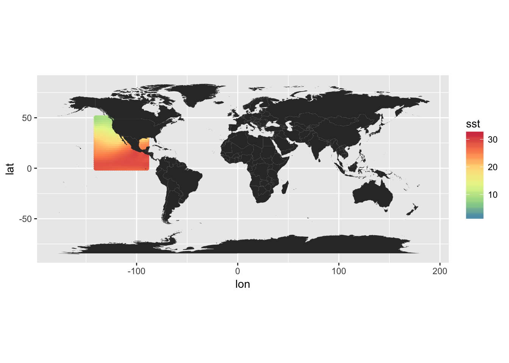
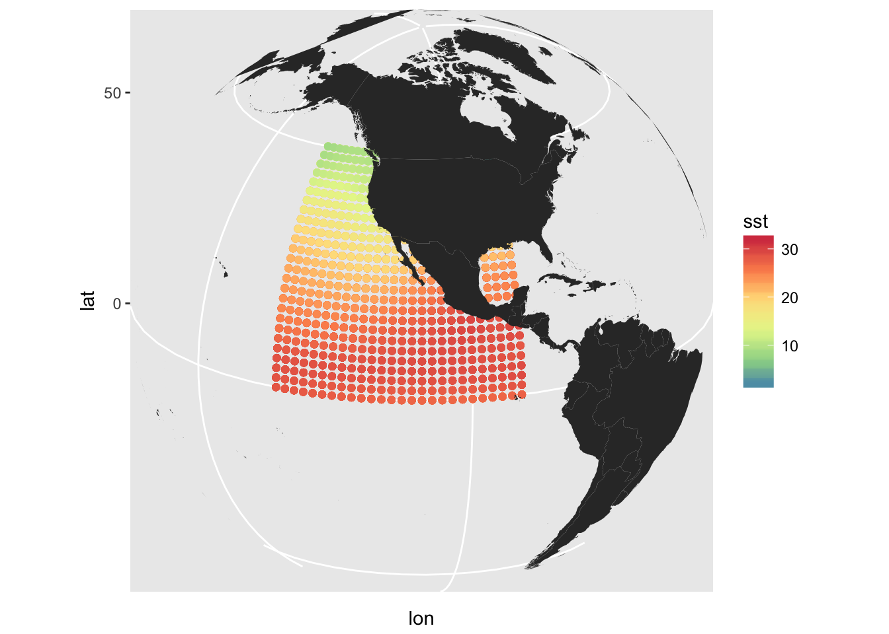
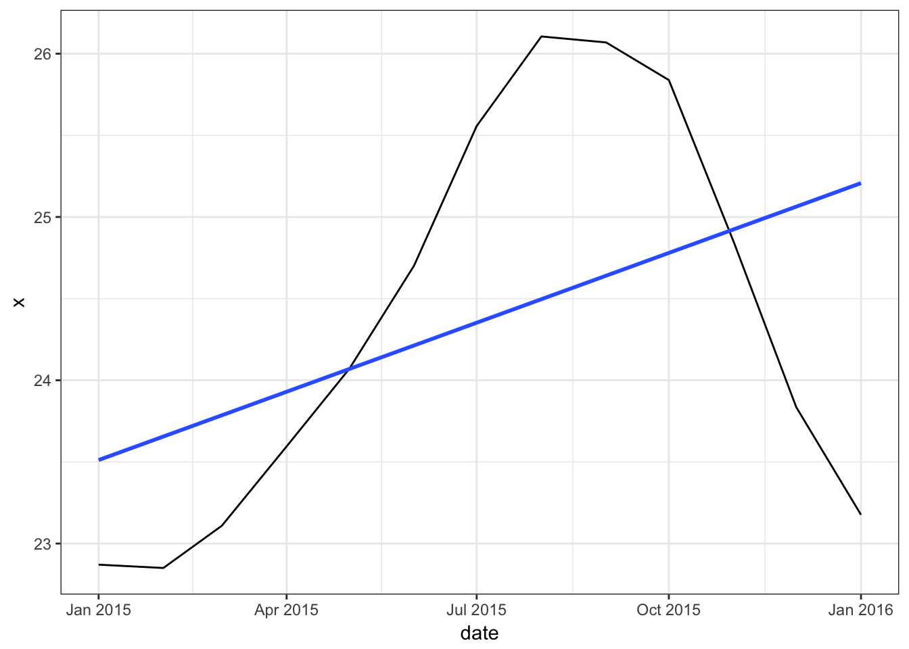

rERDDAP\_pull.R
================
Tyler Gagne
13 July 2017

``` r
library(rerddap)
library(ggplot2)

#search for available gridded data, i.e. what products are availblae based on your search query in this case "ERSST"
datasets <- ed_search(query = 'ERSST', which = "grid")
datasets
```

    ## # A tibble: 15 x 2
    ##                                                                         title
    ##                                                                         <chr>
    ##  1          NOAA Extended Reconstructed SST (ERSST), Version 4 (in situ only)
    ##  2          NOAA Extended Reconstructed SST (ERSST), Version 4 (in situ only)
    ##  3          NOAA Extended Reconstructed SST (ERSST), Version 4 (in situ only)
    ##  4             NOAA ERSSTv4 (in situ only), 2°, Global, Monthly, 1854-present
    ##  5   noaa.ersst, sst.mon.19712000.ltm.v3 (NOAA Extended Reconstructed SST V3)
    ##  6 noaa.ersst, sst.mon.1981-2010.ltm.v3 (NOAA Extended Reconstructed SST V3b)
    ##  7       NOAA Extended Reconstructed SST V3 (noaa.ersst.v3, sst.ltm.19712000)
    ##  8 noaa.ersst.v3, sst.mon.1981-2010.ltm (NOAA Extended Reconstructed SST V3b)
    ##  9                               noaa.oisst.v2.derived, sst.day.1981-2010.ltm
    ## 10 GISTEMP: 1200km smoothing combined land/ocean (air.2x2.1200.mon.anom.comb)
    ## 11   GISTEMP: 250km smoothing combined land/ocean (air.2x2.250.mon.anom.comb)
    ## 12             NOAA Extended Reconstructed SST V3 (noaa.ersst, err.mnmean.v3)
    ## 13            NOAA Extended Reconstructed SST V3b (noaa.ersst, sst.mnmean.v3)
    ## 14             NOAA Extended Reconstructed SST V3 (noaa.ersst.v3, err.mnmean)
    ## 15            NOAA Extended Reconstructed SST V3b (noaa.ersst.v3, sst.mnmean)
    ## # ... with 1 more variables: dataset_id <chr>

``` r
#Then you can get information on a single dataset/product
out <- info('nceiErsstv4') #visible online or on the wider tibble not shown in the above output
out
```

    ## <ERDDAP info> nceiErsstv4 
    ##  Dimensions (range):  
    ##      time: (1854-01-01T00:00:00Z, 2017-06-01T00:00:00Z) 
    ##      depth: (0.0, 0.0) 
    ##      latitude: (-88.0, 88.0) 
    ##      longitude: (0.0, 358.0) 
    ##  Variables:  
    ##      sst: 
    ##          Units: degree_C 
    ##      ssta: 
    ##          Units: degree_C

``` r
#Then query for gridded data using the griddap() function
res <- griddap(out,
               time = c('2015-01-01T00:00:00Z', '2016-01-01T00:00:00Z'),
               latitude = c(0,50),
               longitude = c(220, 270)) #note the 0 - 358 range... (2 deg grid)
```

    ## /Users/tgagne/Library/Caches/R/rerddap found - using it for caching

``` r
datas <- res$data
#remove SST NAs over land
datas <- na.omit(datas)

##attempt to reproject to = -180 to 180 
datas$lon <- ifelse(datas$lon > 180, datas$lon - 360, datas$lon )

world <- map_data("world")

#mapping, FYI this are points on points (i.e., layer on layer), just using to visualize region of capture
```

``` r
A<-ggplot()+
  geom_point(data = datas,aes(x=lon,y=lat, colour = sst))+
  scale_color_distiller(palette = "Spectral")+ 
  geom_polygon(data = world, aes(x=long, y = lat, group = group))

A+coord_fixed()
```



``` r
A+coord_map("ortho", orientation = c(20, 250, 0))
```



``` r
#get mean of each layer by year 
dta.sum <- aggregate(x = datas$sst,
                     FUN = mean,
                     by = list(date = datas$time))

str(dta.sum)
```

    ## 'data.frame':    13 obs. of  2 variables:
    ##  $ date: chr  "2015-01-01T00:00:00Z" "2015-02-01T00:00:00Z" "2015-03-01T00:00:00Z" "2015-04-01T00:00:00Z" ...
    ##  $ x   : num  22.9 22.9 23.1 23.6 24.1 ...

``` r
dta.sum$date <- as.Date(dta.sum$date)

ggplot(dta.sum,aes(x=date,y=x))+
  geom_line()+
  geom_smooth(method = "lm",se = F)+
  theme_bw()
```


